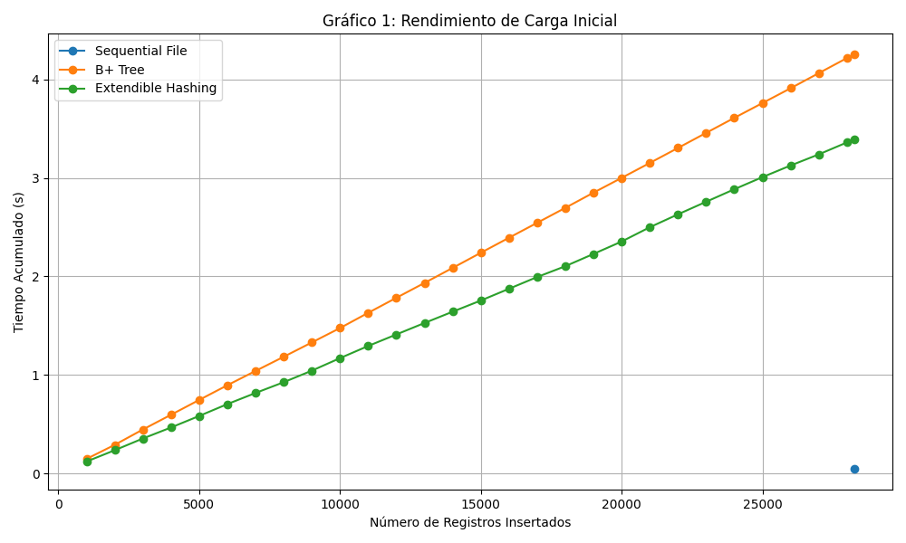
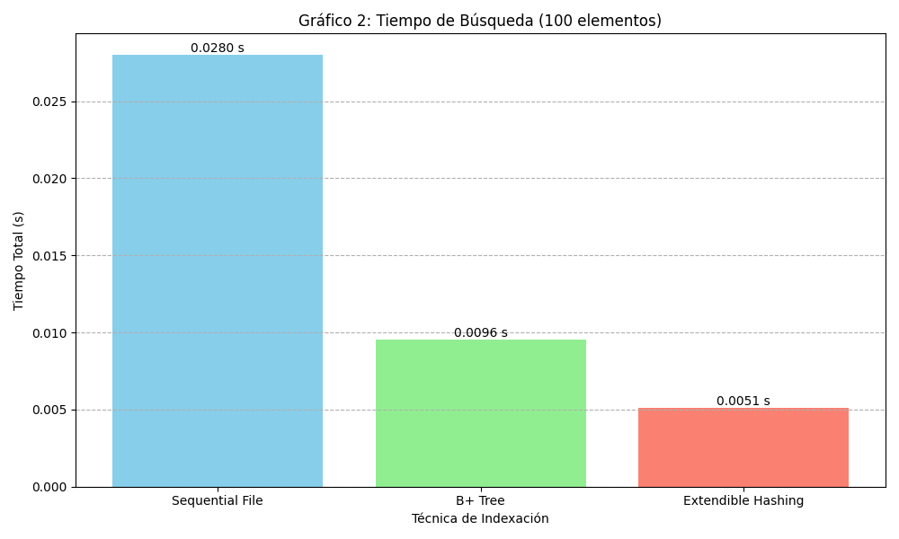
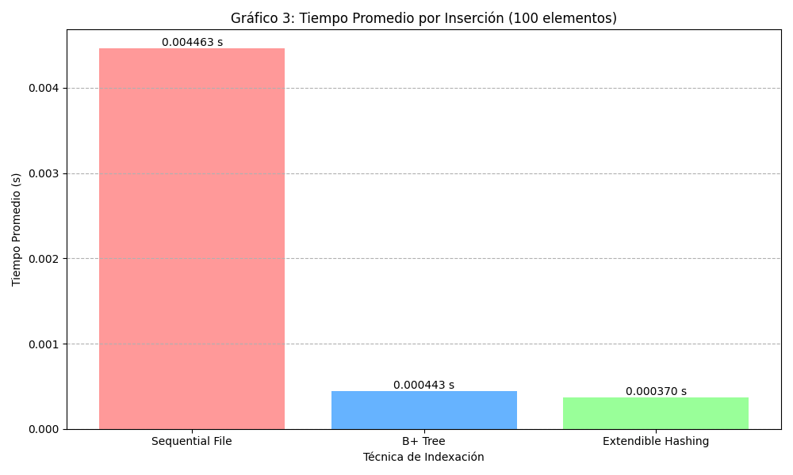
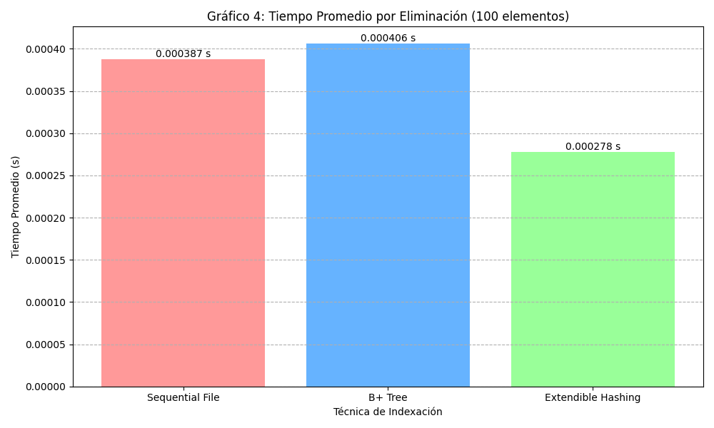
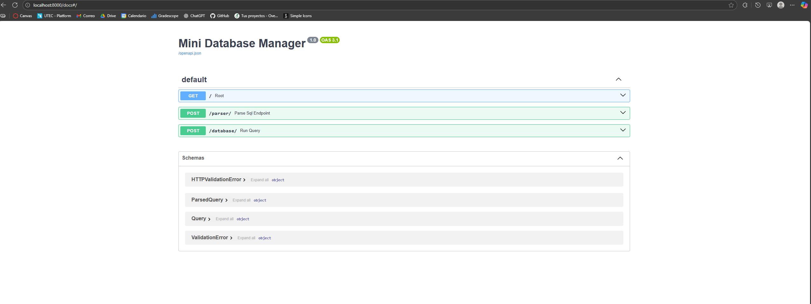
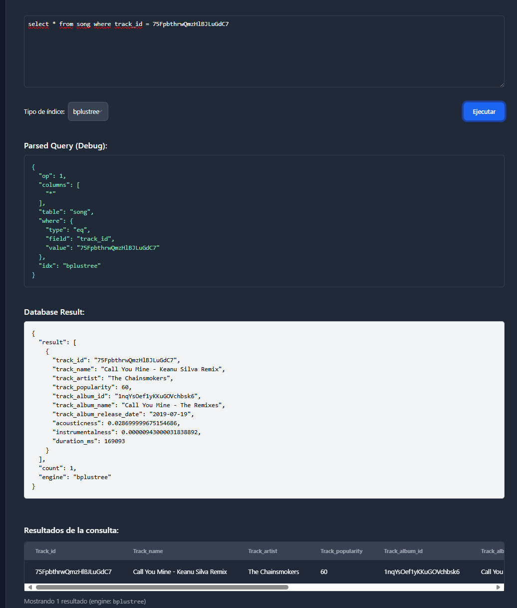
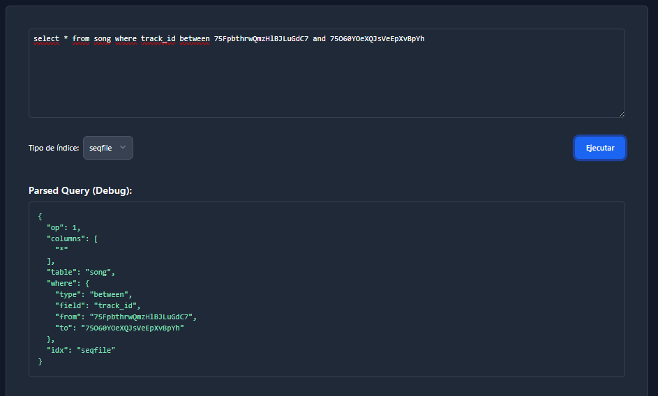
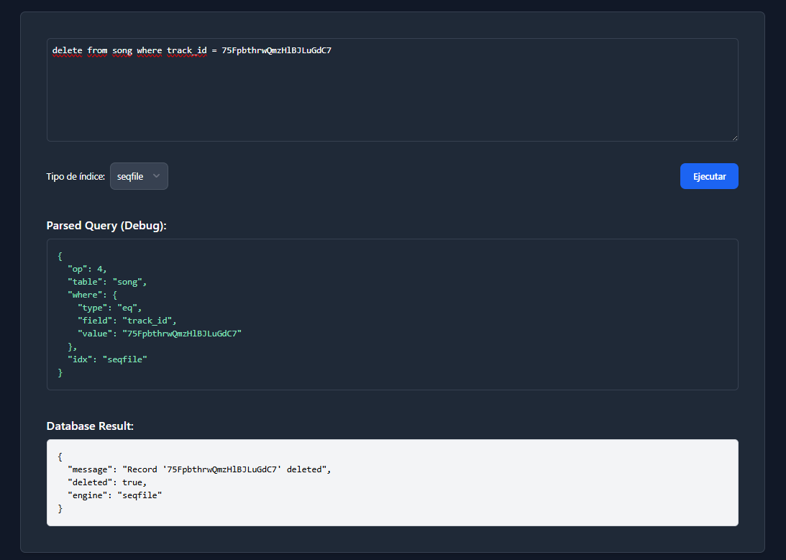
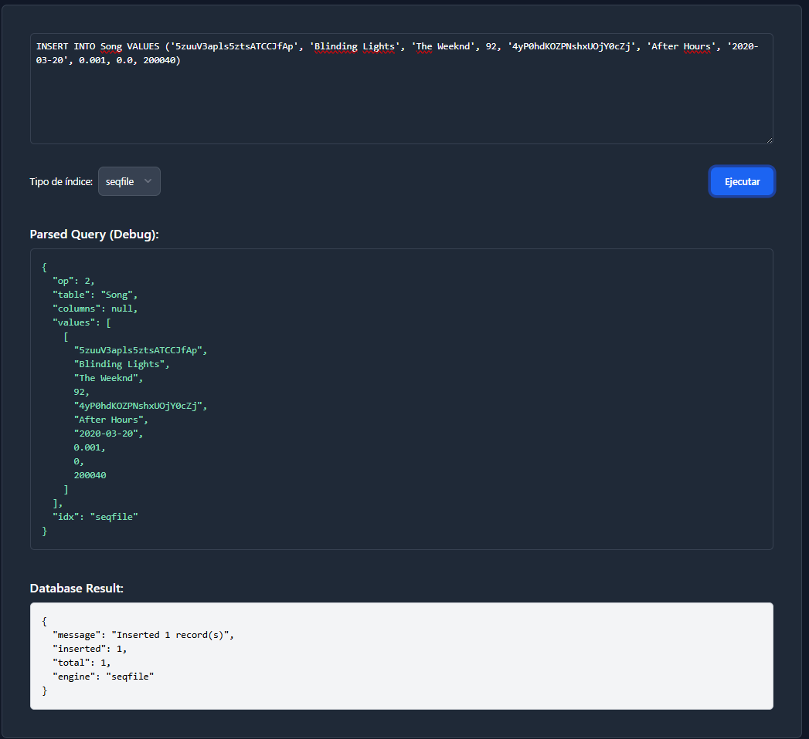

# Proyecto Base de Datos 2 (Primera Parte)

## Nombre del Proyecto: Mini Gestor de Base de Datos

### Numero de Grupo: 2

| Participación | Alumno                                     |
|---------------|--------------------------------------------|
| 100%          | Sebastian Alonso Urbina Claros (202210450) |
| 100%          | Anthony Raul Roca Condori (201720045)      |

## Introducción

### Objetivo del proyecto

El presente proyecto tiene como objetivo diseñar e implementar un mini gestor de bases de datos capaz de manejar grandes volúmenes de información de manera eficiente mediante el uso de diversas técnicas de organización e indexación de archivos.
Se busca comprender y aplicar estructuras como Sequential File, ISAM, Extendible Hashing, B+ Tree y R-Tree, optimizando las operaciones fundamentales de búsqueda, inserción y eliminación sobre datos almacenados en memoria secundaria.

Asimismo, el proyecto pretende integrar el manejo de datos espaciales dentro del modelo relacional, permitiendo realizar consultas multidimensionales y búsquedas por rango o vecinos más cercanos, extendiendo las capacidades tradicionales de un sistema de indexación.

### Descripción de la aplicación

La aplicación desarrollada consiste en un **gestor de datos musicales basado en el dataset de Spotify**, el cual contiene información estructurada sobre canciones, artistas, álbumes y características acústicas.

- El **Sequential File** o **AVL File** se utiliza para el manejo ordenado de registros secuenciales, optimizando las inserciones mediante un área auxiliar y reconstrucción periódica.
- El **Extendible Hashing** se emplea para acceder eficientemente a claves dispersas y dinámicas.  
- El **B+ Tree** permite búsquedas y recorridos por rango, ideal para atributos como la popularidad

Como se dará cuenta, faltan algunas técnicas de implementación que faltan en el proyecto, esto es porque no se logró implementar todo lo esperado.

El sistema cuenta además con un **parser SQL** que traduce consultas de alto nivel a sentencias ejecutables sobre los archivos físicos, con soporte para operaciones como:

```sql
CREATE TABLE Songs (
    track_id INT KEY INDEX SEQ,
    name VARCHAR[30] INDEX BTree,
    duration INT
    etc...
);
```

y consultas de tipo:
```sql
SELECT * FROM Songs where track_id = x
SELECT * FROM Songs WHERE track_id BETWEEN x AND y;
DELETE * FROM Songs WHERE track_id = x
```

### Resultados esperados

Con la implementación de las distintas técnicas de indexación, se espera obtener los siguientes resultados:

1. **Reducción significativa del tiempo de búsqueda** respecto al acceso secuencial tradicional.  
2. **Optimización del uso de memoria secundaria**, midiendo la eficiencia mediante el número total de accesos a disco (lecturas y escrituras).  
3. **Capacidad de realizar consultas por rango y espaciales** en un entorno interactivo, evidenciando la versatilidad de los índices combinados.  
4. **Interfaz gráfica funcional y amigable**, que permita visualizar los resultados de las consultas y comprobar el rendimiento de cada técnica.  
5. **Comparación experimental y teórica** de las estructuras implementadas, validando empíricamente sus ventajas según el tipo de consulta y la naturaleza de los datos.

## Técnicas utilizadas

### Sequential File

#### Descripción
Sequential File es una estructura de datos que organiza los registros de forma secuencial ordenada en un archivo principal, complementado con un archivo auxiliar para nuevas inserciones. Mantiene el orden lógico mediante punteros que enlazan los registros.

#### Características
- **Archivo principal**: Registros ordenados por clave primaria
- **Archivo auxiliar**: Almacena nuevas inserciones temporalmente
- **Reorganización periódica**: Fusiona ambos archivos cuando el auxiliar crece

#### Operaciones

**Búsqueda**: 
- Búsqueda binaria en archivo principal: O(log n)
- Búsqueda secuencial en archivo auxiliar: O(log k), donde k es el tamaño del auxiliar

**Inserción**:
- Siempre en archivo auxiliar: O(1)
- Cuando realiza reconstrucción: O(N + k)

**Eliminación**:
- Marca registro como eliminado: O(log n) (En archivo principal), O(k) en archivo aux (Borrado físico)
- En el archivo principal no elimina físicamente hasta reorganización

### Extendible Hashing

#### Descripción
Extendible Hashing es una técnica de indexación dinámica basada en hashing que utiliza un directorio de punteros y buckets de datos. Se adapta al crecimiento de datos mediante duplicación del directorio y división de buckets, evitando reorganización completa del archivo.

#### Estructura

```
Directorio (D=2)          Buckets
┌─────┬─────┐
│ 00  │  ───┼──────────▶ Bucket 0 (d=1)
│ 01  │  ───┼──────────▶ Bucket 1 (d=1)
│ 10  │  ───┼──────────▶ Bucket 0 (d=1)
│ 11  │  ───┼──────────▶ Bucket 1 (d=1)
└─────┴─────┘
```

**Componentes**:
- **Directorio**: Array de punteros con profundidad global D
- **Buckets**: Páginas de datos con profundidad local d
- **Factor de bloque M**: Máximo de registros por bucket
- **Función hash**: Determina ubicación usando últimos D bits

#### Operaciones

**Búsqueda**:
1. Aplica hash(key)
2. Extrae últimos D bits
3. Accede al bucket correspondiente
4. Búsqueda secuencial en bucket
- **Complejidad**: O(1) promedio, 1-2 accesos a disco

**Inserción**:
1. Localiza bucket destino
2. Si hay espacio: inserta directamente
3. Si está lleno:
   - Si d < D: divide bucket (split)
   - Si d = D: duplica directorio, luego divide

**División de bucket (Split)**:
```
Antes (D=2, d=1):              Después (D=2, d=2):
Bucket 0: [00, 10]             Bucket 0: [00]
                    ──────▶    Bucket 2: [10]
```

**Eliminación**:
1. Localiza y remueve registro
2. Si bucket queda vacío: puede fusionarse (opcional)

#### Ventajas
- Crece dinámicamente sin reorganización completa
- Búsquedas rápidas (1-2 accesos a disco)
- Buen desempeño con datos uniformemente distribuidos

### B+ Tree

#### Descripción
B+ Tree es una estructura de árbol balanceado multinivel optimizada para sistemas de almacenamiento en disco. Mantiene todos los datos en las hojas, conectadas mediante punteros secuenciales, mientras los nodos internos solo almacenan claves para navegación.

#### Estructura

```
                    [Nodo Raíz]
                   /     |     \
                  /      |      \
            [Índice]  [Índice]  [Índice]
            /    \     /    \    /    \
         [H] ─▶ [H] ─▶ [H] ─▶ [H] ─▶ [H]
         Hojas enlazadas (registros)
```

**Componentes**:
- **Nodos internos**: Claves separadoras y punteros a hijos (máximo R-1 claves)
- **Nodos hoja**: Registros completos y punteros al siguiente (máximo M registros)
- **Punteros secuenciales**: Enlazan todas las hojas para range queries

#### Propiedades
- **Orden R**: Máximo R hijos por nodo interno (R = 40 en implementación)
- **Factor M**: Máximo M registros por hoja (M = 20 en implementación)
- **Balanceo**: Todos los caminos de raíz a hoja tienen la misma longitud
- **Ocupación mínima**: Nodos al menos 50% llenos (excepto raíz)

#### Operaciones

**Búsqueda**:
1. Inicia en raíz
2. Compara clave con separadores
3. Desciende por puntero correspondiente
4. Repite hasta llegar a hoja
5. Búsqueda secuencial en hoja
- **Complejidad**: O(log_R n) accesos a disco

**Búsqueda por rango**:
1. Localiza hoja con clave inicio
2. Recorre hojas secuencialmente usando punteros
3. Retorna registros hasta clave fin
- **Complejidad**: O(log_R n + k), donde k es tamaño del resultado

**Inserción**:
1. Localiza hoja destino
2. Inserta ordenadamente
3. Si desborda (count > M):
   - Divide hoja en dos
   - Propaga clave separadora hacia arriba
   - Si nodo padre desborda: divide recursivamente

**División de hoja**:
```
Antes:                    Después:
Hoja: [1,2,3,4,5]        Hoja L: [1,2] ─▶ Hoja R: [3,4,5]
                         Sube clave: 3
```

**Eliminación**:
1. Localiza y remueve registro
2. Si hoja queda subdimensionada: puede fusionarse o redistribuir (simplificado en implementación)

#### Ventajas
- Excelente para range queries (hojas enlazadas)
- Altura baja (log_R n)
- Todas las operaciones O(log n)
- Buen aprovechamiento de caché de disco

### R Tree

#### Descripción
R-Tree es una estructura de árbol balanceado especializada en datos espaciales multidimensionales. Organiza objetos en rectángulos delimitadores (MBR - Minimum Bounding Rectangle) que se agrupan jerárquicamente, optimizando búsquedas espaciales como intersecciones y proximidad.

#### Estructura

```
                 [Raíz: MBR global]
                /                  \
        [MBR región 1]        [MBR región 2]
         /        \              /        \
    [MBR A]    [MBR B]      [MBR C]    [MBR D]
     /  \       /  \         /  \       /  \
   P1   P2   P3   P4      P5   P6    P7   P8
   (Puntos/objetos espaciales)
```

#### Características
- **MBR (Minimum Bounding Rectangle)**: Rectángulo mínimo que encierra un conjunto de objetos
- **Nodos internos**: Almacenan MBRs de regiones hijas
- **Nodos hoja**: Contienen objetos espaciales (puntos, polígonos)
- **Búsquedas espaciales**: Intersección, contención, proximidad (KNN), rango circular

#### Operaciones Espaciales

**Búsqueda por rango circular** (`IN (punto, radio)`):
1. Inicia en raíz
2. Verifica si MBR intersecta con círculo de búsqueda
3. Desciende solo en MBRs que intersectan
4. En hojas: calcula distancia euclidiana para cada punto
5. Retorna puntos dentro del radio

**Inserción**:
1. Selecciona hoja con mínimo agrandamiento de MBR
2. Inserta objeto y actualiza MBR
3. Si desborda: divide nodo (split espacial)
4. Propaga splits hacia arriba

### Análisis Comparativo

#### Complejidad de Operaciones

| Operación | Sequential File | Extendible Hashing | B+ Tree |
|-----------|----------------|-------------------|---------|
| **Búsqueda** | O(log n) + O(log k) | O(1) promedio | O(log_R n) |
| **Inserción** | O(1) auxiliar | O(1) promedio | O(log_R n) |
| **Eliminación** | O(log n) | O(1) promedio | O(log_R n) |
| **Range Query** | O(log n + k) | O(n) | O(log_R n + k) |

*k: tamaño de archivo auxiliar o resultado*

#### Accesos a Disco

| Operación | Sequential File | Extendible Hashing | B+ Tree |
|-----------|----------------|-------------------|---------|
| **Búsqueda** | 1 (binaria) + k (auxiliar) | 1-2 (directorio + bucket) | h (altura del árbol, ~3-4) |
| **Inserción** | 2 (leer + escribir auxiliar) | 2-3 (directorio + bucket) | 2h (bajar + subir) |
| **Range Query** | n/2 promedio (secuencial) | n (scan completo) | h + k/M (hojas consecutivas) |

#### Tabla Resumen de Elección

| Escenario | Técnica Recomendada | Razón |
|-----------|---------------------|-------|
| Búsquedas por clave exacta | Extendible Hashing | O(1) promedio |
| Range queries frecuentes | B+ Tree | Hojas enlazadas |
| Dataset pequeño, pocas actualizaciones | Sequential File | Simplicidad |
| Alta tasa de inserciones | Extendible Hashing | Sin reorganización |
| Uso general balanceado | B+ Tree | Buen desempeño en todo |
| Consultas espaciales | R-Tree | Optimizado para geometría |

#### Conclusión

En el contexto del proyecto:
- **B+ Tree** es la opción más versátil y fue implementada completamente
- **Extendible Hashing** complementa para casos de búsqueda exacta intensiva
- **Sequential File** sirve como baseline para comparación
- **R-Tree** queda preparado para extensiones con datos espaciales

### Parser SQL

El parser SQL es el componente encargado de traducir consultas SQL en texto plano a estructuras JSON procesables por el backend. Implementa un analizador sintáctico basado en expresiones regulares que identifica y valida cinco operaciones: CREATE TABLE, SELECT, INSERT, DELETE e IMPORT.

#### Arquitectura

```
┌─────────────────────────────────────────────────────────────┐
│                    Endpoint: /parser                         │
│                  Recibe SQL en texto plano                   │
└─────────────────────┬───────────────────────────────────────┘
                      │
                      ▼
            ┌─────────────────────┐
            │  Identificación de  │
            │  operación (CREATE, │
            │  SELECT, INSERT...) │
            └──────────┬──────────┘
                       │
         ┌─────────────┴─────────────┐
         ▼                           ▼
┌────────────────┐          ┌────────────────┐
│ Validación con │          │  Extracción de │
│     Regex      │──────────▶│  componentes   │
└────────────────┘          └────────┬───────┘
                                     │
                                     ▼
                            ┌────────────────┐
                            │ Construcción   │
                            │ ParsedQuery    │
                            │     (JSON)     │
                            └────────────────┘
```

#### Funcionamiento por operación

##### CREATE TABLE
Extrae el nombre de la tabla y la definición de columnas, normalizando los tipos de datos.

**Entrada:**
```sql
CREATE TABLE Song (track_id varchar[30], duration_ms int)
```

**Proceso:**
1. Regex captura tabla y columnas: `([A-Za-z_][A-Za-z0-9_]*)\s*\((.*)\)`
2. Normaliza tipos: `varchar[30]` → `varchar(30)`
3. Divide columnas respetando corchetes anidados

**Salida:**
```json
{
  "op": 0,
  "table": "Song",
  "columns": [
    {"name": "track_id", "type": "varchar(30)"},
    {"name": "duration_ms", "type": "int"}
  ]
}
```

##### SELECT
Identifica la tabla, columnas y condiciones WHERE (igualdad, rango o búsqueda espacial).

**Entrada:**
```sql
SELECT * FROM Song WHERE track_id BETWEEN '0' AND '5'
```

**Proceso:**
1. Extrae tabla y columnas
2. Detecta tipo de WHERE:
   - `=` → `"type": "eq"`
   - `BETWEEN ... AND` → `"type": "between"`
   - `IN (punto, radio)` → `"type": "in_circle"` (para R-Tree)

**Salida:**
```json
{
  "op": 1,
  "table": "Song",
  "columns": ["*"],
  "where": {"type": "between", "field": "track_id", "from": "0", "to": "5"}
}
```

##### INSERT
Soporta inserción simple y múltiple (bulk) usando sintaxis `{...}, {...}`.

**Entrada:**
```sql
INSERT INTO Song VALUES 
  {'id1', 'Song 1', 'Artist', 85},
  {'id2', 'Song 2', 'Artist', 90}
```

**Proceso:**
1. Detecta objetos entre llaves usando contador de niveles
2. Divide cada objeto en valores individuales
3. Parsea literales (strings, números, bools)

**Salida:**
```json
{
  "op": 2,
  "table": "Song",
  "values": [
    ["id1", "Song 1", "Artist", 85],
    ["id2", "Song 2", "Artist", 90]
  ]
}
```

##### DELETE
Solo permite eliminación con WHERE de igualdad exacta por seguridad.

**Entrada:**
```sql
DELETE FROM Song WHERE track_id = '5zuuV3apls'
```

**Salida:**
```json
{
  "op": 4,
  "table": "Song",
  "where": {"type": "eq", "field": "track_id", "value": "5zuuV3apls"}
}
```

##### IMPORT
Permite carga masiva desde CSV especificando el tipo de índice.

**Entrada:**
```sql
IMPORT INTO Song FROM FILE 'spotify_songs.csv' USING INDEX bplustree(track_id)
```

**Salida:**
```json
{
  "op": 3,
  "table": "Song",
  "file": "spotify_songs.csv",
  "index": {"type": "bplustree", "column": "track_id"}
}
```

#### Funciones Auxiliares Clave

##### `_parse_literal()`
Convierte strings en tipos apropiados:
- `'hello'` → `"hello"` (string)
- `123` → `123` (int)
- `45.6` → `45.6` (float)
- `true` → `True` (bool)

##### `_split_csv_top()`
Divide listas por comas respetando delimitadores anidados:
```python
"'hello, world', 123, [1, 2]" → ["'hello, world'", "123", "[1, 2]"]
```

Mantiene contadores de niveles para paréntesis, corchetes y comillas, solo divide cuando todos están en nivel 0.

#### Códigos de Operación

| Código | Operación |
|--------|-----------|
| 0 | CREATE TABLE |
| 1 | SELECT |
| 2 | INSERT |
| 3 | IMPORT |
| 4 | DELETE |

## Resultados Experimentales

A continuación, se presenta un análisis del rendimiento experimental de tres técnicas de indexación de archivos: Archivo Secuencial, Árbol B+ y Hashing Extensible. Se evaluan la carga inicial, búsqueda, inserción y eliminación.

Gráfico 1: Rendimiento de Carga Inicial


#### **Análisis de Resultados**
Los resultados son consistentes con la teoría y las implementaciones utilizadas:

- **Sequential File**: El rendimiento superior se debe al uso de una operación de carga masiva (bulk_load). Este método ordena todos los registros en memoria y luego los escribe en el disco en una única pasada secuencial. La escritura secuencial es la operación de I/O más rápida posible, lo que explica su eficiencia abrumadora para poblar la estructura desde cero.

- **Extendible Hashing**: Su curva lineal demuestra la eficiencia de su complejidad de inserción, que es O(1) en promedio. Cada add implica un cálculo de hash y una escritura en un bucket, operaciones muy rápidas y localizadas que escalan de manera predecible.

- **B+ Tree**: Aunque su complejidad de inserción es un eficiente O(logN), requiere atravesar el árbol desde la raíz hasta una hoja para cada uno de los registros. La suma de estos recorridos logarítmicos es intrínsecamente más costosa que el acceso directo del hashing, resultando en un tiempo total mayor para la carga uno por uno.

Gráfico 2: Tiempo de Búsqueda


#### **Análisis de Resultados**

- **Sequential File**: El bajo rendimiento se debe a una ineficiencia en la implementación original. Por cada búsqueda que falla en el archivo principal, el código procedía a leer el archivo auxiliar completo del disco. Repetir esta costosa operación de I/O múltiples veces crea un cuello de botella. Con una estrategia de caché en memoria para el archivo auxiliar, su rendimiento mejoraría bastante.

- **Extendible Hashing**: Es el rey de la velocidad para búsquedas por clave. Tras la corrección que mantiene el directorio en memoria, una búsqueda implica un cálculo de hash (instantáneo) y típicamente una sola lectura de disco para obtener el bucket. Es el epítome del acceso directo.

- **B+ Tree**: Su rendimiento es excelente. Gracias a su estructura ancha y poco profunda, una búsqueda solo requiere leer unos pocos nodos para localizar cualquier registro. Es un modelo de eficiencia en accesos a disco dirigidos.

Gráfico 3: Tiempo Promedio por Inserción


#### **Análisis de Resultados**

- **Sequential File**:  La lentitud se debe a que, para mantener el orden en el archivo auxiliar, la implementación reescribe el archivo completo en el disco con cada inserción. Realizar 100 inserciones implica 100 operaciones de reescritura, lo cual es muy ineficiente.

- **Extendible Hashing**: Nuevamente, su complejidad promedio de O(1) le da la ventaja. La mayoría de las inserciones solo requieren añadir un registro a un bucket existente, implicando una única operación de escritura en disco.

- **B+ Tree**: El costo de O(logN) se mantiene bajo y predecible. La operación consiste en un recorrido rápido por el árbol y una escritura en una página de datos, lo cual es muy eficiente.


Gráfico 4: Tiempo Promedio por Eliminación


#### **Análisis de Resultados**

- **Sequential File**: El buen rendimiento se debe al uso de borrado lógico en el archivo principal. Esta operación consiste en una búsqueda binaria (O(logN)) para encontrar la posición y una única escritura para cambiar un bit de estado. Es más simple y rápido que mantener la integridad estructural del B+ Tree.

- **Extendible Hashing**: La eliminación es prácticamente la operación inversa de la búsqueda. Con una complejidad promedio de O(1), requiere un mínimo de I/O para localizar y eliminar el registro del bucket.

- **B+ Tree**: La eliminación es O(logN), pero puede ser más compleja que la inserción. Además de borrar, el árbol debe verificar si la página queda por debajo de su ocupación mínima, lo que podría desencadenar operaciones de fusión o redistribución con páginas vecinas, añadiendo un pequeño costo de I/O adicional.

### **Conclusiones generales**
Los resultados experimentales validan los fundamentos teóricos de cada estructura y subrayan la importancia crítica de una implementación eficiente en el manejo de operaciones de disco (I/O).

- **Sequential File**: Es imbatible para la carga masiva inicial gracias a su eficiente escritura secuencial. Sin embargo para esta implementación en específico las estrategias de reescritura completa del archivo auxiliar en cada inserción y su relectura completa durante la búsqueda demostraron ser cuellos de botella que lo hicieron menos competitivo que las otras estructuras. Se tomará en cuenta este detalle.

- **Extendible Hashing**: Es la estructura superior para operaciones puntuales (búsqueda, inserción, eliminación) de alto rendimiento, siempre que su directorio se gestione eficientemente en memoria.

- **B+ Tree**: Se consolida como la opción más equilibrada y robusta. Ofrece un rendimiento excelente y predecible en todas las operaciones, justificando su uso generalizado en sistemas de bases de datos.


## Pruebas de uso y presentación

1. Imagenes de docker luego de realizar el compose up.


2. Contenedores de docker corriendo.


3. Frontend


4. Backend



5. Pruebas de select






6. Pruebas de delete



7. Pruebas de insert



Explicación a detalle en el video.

## Link del video: [Video del Proyecto](https://drive.google.com/file/d/1k4rDznILHCyjXaQK_HanjRdoKrFoZCET/view?usp=sharing)
